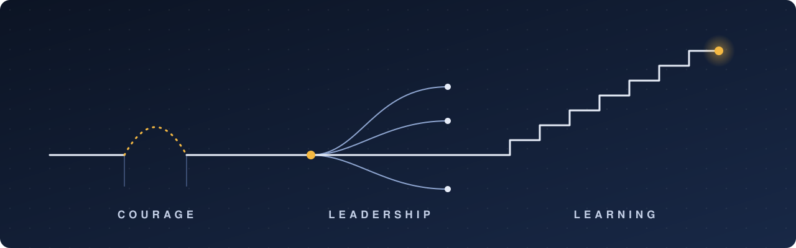

_Notes to myself: what I value, how I act on it, and what changed my thinking._

## Courage

When you can't change the situation, change your position in it, even when that is scary.

## Leadership

Give each person an outcome to own, and the room to reach it their own way.

## Learning

Every Sunday, schedule one learning goal for the week ahead.

## Meaningful Resources

- **Book**: [_The Timeless Way of Building_](https://www.amazon.com/dp/0195024028) by Christopher Alexander. Good design grows from recurring patterns people already live by, not from a master plan.
- **Application**: [Obsidian](https://obsidian.md). Notes are a web of linked ideas, not a filing cabinet.
- **Website**: [Cabrera Lab](https://www.cabreralab.science/). Systems thinking is a small set of mental moves you can practise: distinctions, systems, relationships, perspectives.
- **Podcast**: [The Learning Leader Show](https://learningleader.com) with Ryan Hawk. Leadership is learned by studying how others do it, not a trait you have or lack.
